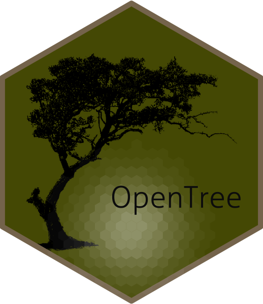

# OpenTree 
OpenTree is an R package developed with collaboration with DARTH that allows building decision trees interactively in R.  

## Getting started: 
to get started using OpenTree, open the file Introduction OpenTree.Rmd in RStudio. The file contains instruction on how to start OpenTree and also be able to build your first decision tree interactively and integrate it with R. 

 

Instruction on how to install OpenTree can be found on Vimeo:
https://vimeo.com/646960252/da5758ec62

